# azure-docker 🖥️ 🐳

### Intro:

We are gonna create a Debian VM in Azure and the connect it through SSH protocol with our local machine. Then we will install docker and git on it.

### Quick refresher:

Let's refresh some SSH concepts:

- SSH is an encripted connection protocol

- Have secure sign-ins over unsecured connections

- Is the default connection protocol for linux VMs

- Is recommended by Microsoft to connect to a VM over SSH keys (public-private key pair)
    - public key -> on linux VM
    - private key -> on local system

### VM creation:

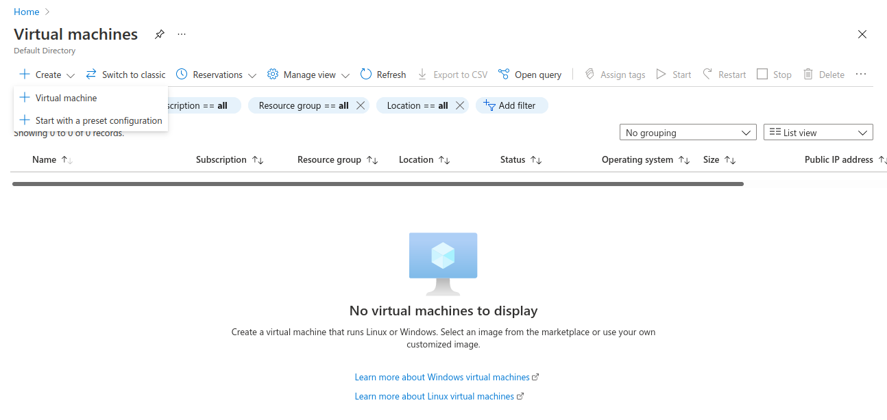

First we click on create VM

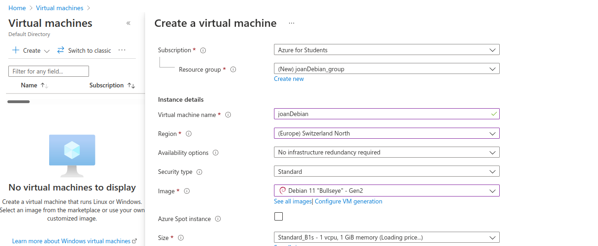

then select the features of our machine

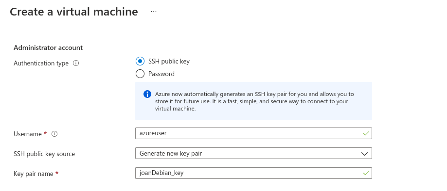

select the ssh keys

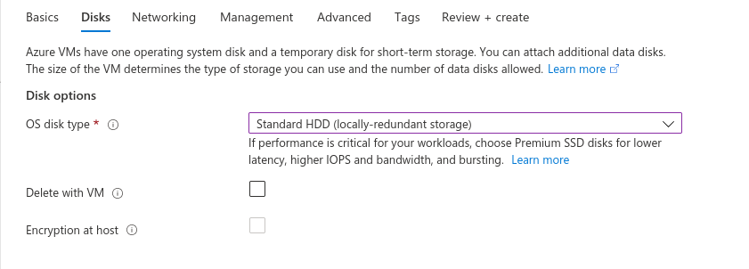

Our disk characteristics

Create our machine

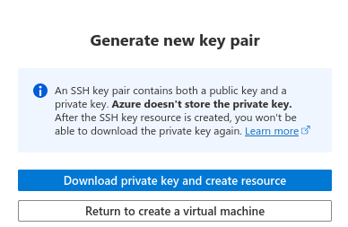

generate keypair

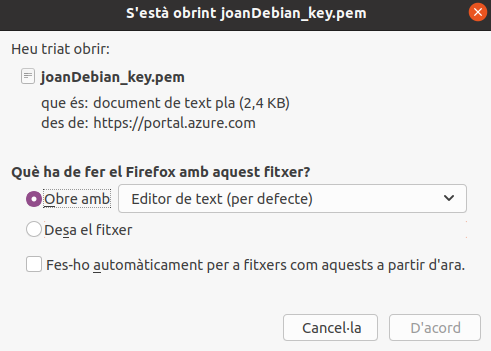

download key pair

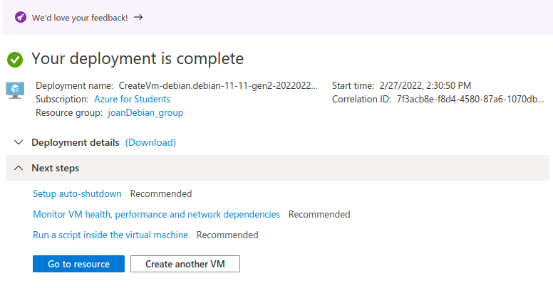

vm created with success

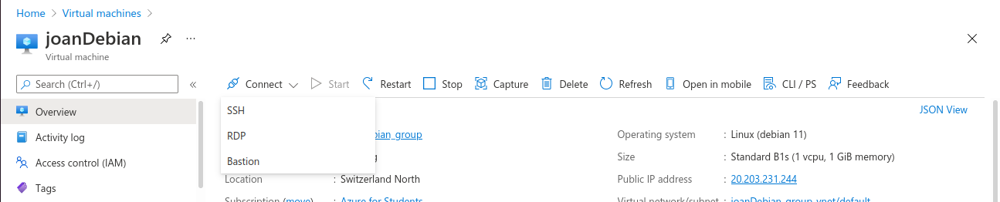

Due to technical problems we connect with a password instead of ssh keypair. SO we proceed and get the public ip address of the VM

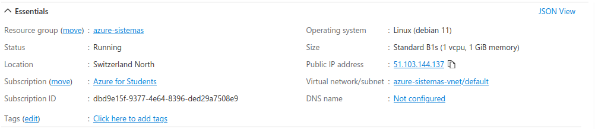

execute the following command to start the connection

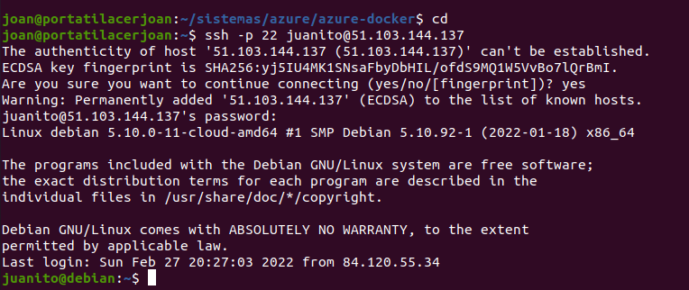

now that are connected, we install git

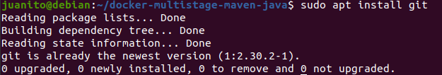

check for its version

Now we are ready to install docker, but in ninja mode

check for its version

Now we are ready to dockerize our app, so do a clone from our github repo

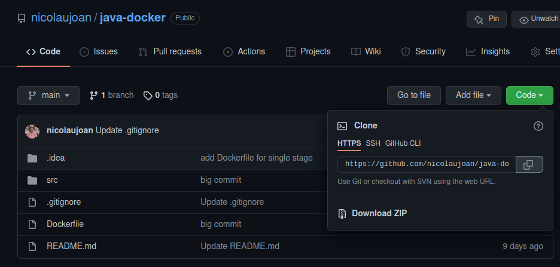

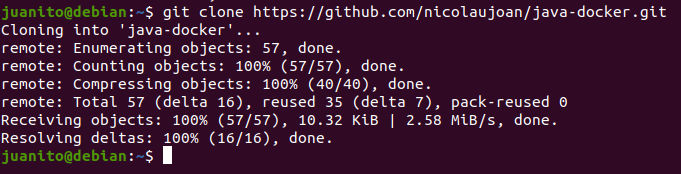

ready to build

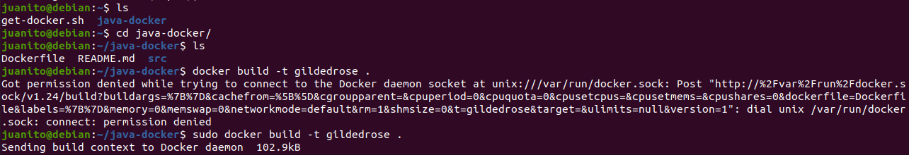

build success

finally, run the container

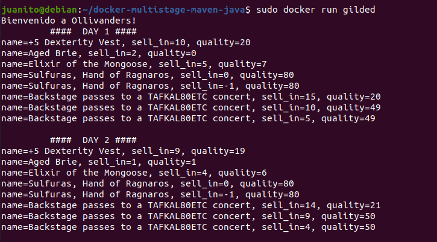

